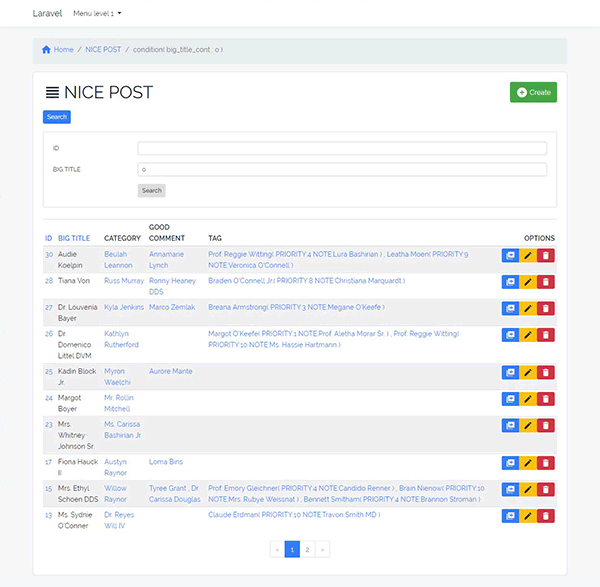
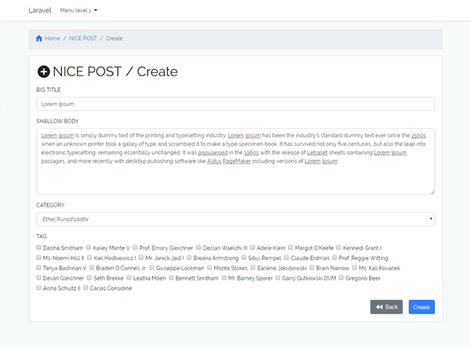
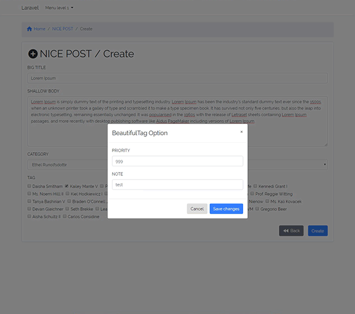
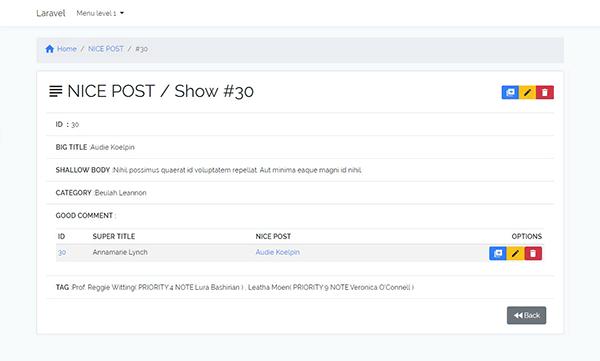
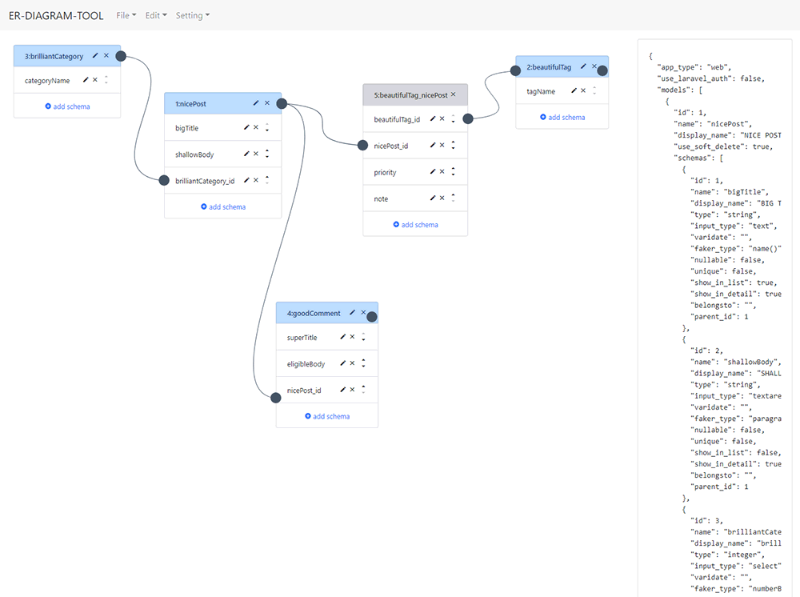

# Crud-D-Scaffold for Laravel 5.6

  Hi, this is a scaffold generator for Laravel 5.6.
  You can Create Basic CRUD application by using this package.<br>
  (For laravel 5.5, use package version 2.6.0)

## Demo & Screen Capture

Demo Site<br>
<a href="https://demo-cds.dog-ears.net/" target="_blank">https://demo-cds.dog-ears.net/</a>

<a href="./img/cap01.gif"></a>
<a href="./img/cap02.gif"></a>
<a href="./img/cap03.gif"></a>
<a href="./img/cap04.gif"></a>

## Outline
  The CRUD application generated by this package has the following features.

  [ General ]
* In addition to the basic CRUD (create, detail, update, delete), there is a "Duplicate" function.
* Adopted Bootstrap 4 for display
* Describe application configuration in setting file -> Automatic generation completed by command execution.
* it is possible to create One-to-many and many-to-many relation between two models
* The main creation files are model, controller, migration, seeding, view
* You can use this package with laravel auth.

[ Index Page ]
* Refine search available
* You can sort by each item.(Except for many-to-many relation column)
* Pager function.
* You can set columns Display or non-display in the initial setting file.
* When deleting, there is confirmation.

[ Create / Edit / Duplication ]
* Input format can be selected from input or textarea
* However, a column with belongsto relation displays a pulldown. And a column with many-to-many relation displays checkboxes.


## Latest Release note

Ver 3.0.0 Renewal<br>
Ver 2.6.0 Add Varidation and keep old input value.<br>
Ver 2.5.3 bugfix


## How to installation and execution

### Step 1: Installing package through Composer

```
composer require dog-ears/crud-d-scaffold
```

### Step 2: Run Artisan!

You're all set.
Run `php artisan` from the console, and you'll see the new commands below.
```
- 'crud-d-scaffold:setup' : Setup crud-d-scaffold with bootstrap 3
```

  This completes the preparation.  
  Let's register the sample.  

### Step 3: Crud-D-Scaffold

##### (i) publish public resource.
```
php artisan vendor:publish --tag=public --force
```
##### (ii) Copy /vendor/dog-ears/crud-d-scaffold/crud-d-scaffold_case0010.json to your laravel project root
```
cp ./vendor/dog-ears/crud-d-scaffold/crud-d-scaffold_case0010.json ./crud-d-scaffold.json
```
##### (iii) run crud-d-scaffold:setup
```
php artisan crud-d-scaffold:setup -f
```
  Overwriting the file with -f option.  
  For the first time, the f option is unnecessary. (No problem with putting on)

##### (iv) run migration and seeding
```
php artisan migrate
```
```
php artisan db:seed
```

  It's all over.  
  Please check your application.

  If you want to modify the application structure,
  After running [migrate: rollback], delete the migration file (/ database / migrations /) and then
  execute [ Crud-d-scaffold: setup-f ]


## How to create crud-d-scaffold.json

see crud-d-scaffold_case00XX.json

- /*...*/ It is treated as a comment.

and now you can create crud-d-scaffold.json from this site.

ER-DIAGRAM-TOOL<br>
<a href="http://er.dog-ears.net/" target="_blank">http://er.dog-ears.net/</a>

<a href="./img/cap05.gif"></a>

## Options
-f, --force Overwrite the file. (If there is an existing file in the absence of the option, processing stops there.)


## Usage notes
* You can use laravel auth. At first [ php artisan make:auth ] and run crud-d-scaffold.
* Column names, model names, etc. are automatically converted according to the convention of laravel, so it is not possible to create singular and plural models at the same time.


## Testing

This package is tested by laravel dusk.
see below repository.

https://github.com/dog-ears/crud-d-scaffold-dusktest3


## See more information

visit my blog
<http://dog-ears.net/en/category/laravel/package/scaffold/history/>
